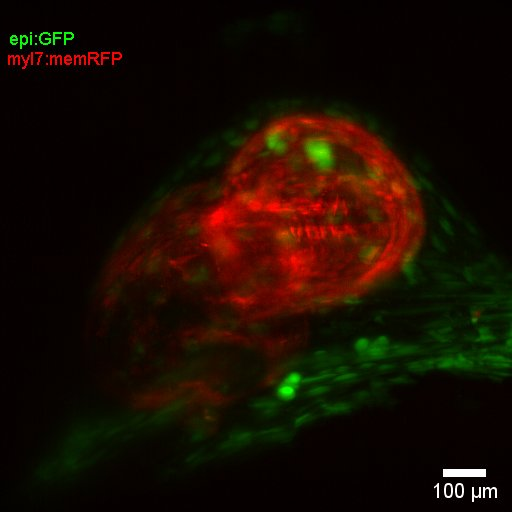

<!DOCTYPE html>
<html>
<head>
Make_timelapse by Alexander Ernst
</head>
<body>

<h1> Make_timelapse</h1>

This tool was made in context of 6D-imaging of the beating heart and is made to assemble a time lapse from individual movies of a beating heart at different time points to follow the development of the zebrafish heart. 
Either you select the same frame for each time point or you provide a table, which allows to choose a different frame for each time point. 

The table can be created in excel with one column "Frame selected" which sequentially lists the desired frame per loop, it should be saved as tab-separated .txt-file.

Testdata can be provided on request, as the files are between 500 - 1500 gb big. 

Alexander Ernst
Institute of anatomy, University of Bern
Programmed in Jython, tested on FIJI: IJ.getVersion: 2.0.0-rc-69/1.52p   and java.version: 1.8.0_172
<h1> Installation </h1>

1. Simply copy Make_timelapse to your "FIJI/Plugins/" directory and restart FIJI. 
2. Start Make_timelapse from inside FIJI in the Plugins tab.   

</body>
</html>

